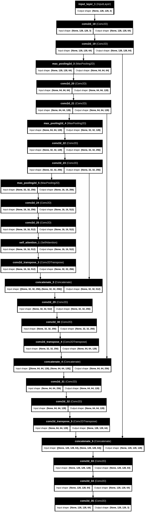

# Semantic-segmentation-using-Self-Attention-weighted-UNet

Semantic segmentation is a fundamental task in
computer vision, involving the classification of each pixel in
an image. This work presents an enhanced U-Net architecture
augmented with a self-attention mechanism to better capture
long-range dependencies and improve segmentation performance.
The method is evaluated on the Oxford-IIIT Pet dataset, demon-
strating improved accuracy and boundary delineation compared
to classical U-Net.


## Project Overview

Semantic segmentation is a fundamental task in computer vision, involving the classification of each pixel in an image. This project implements an **enhanced U-Net architecture augmented with a self-attention mechanism** to better capture long-range dependencies and improve segmentation performance.

The model is evaluated on the [Oxford-IIIT Pet dataset](https://www.robots.ox.ac.uk/~vgg/data/pets/), demonstrating improved accuracy and boundary delineation compared to classical U-Net.

---

## Architecture

The enhanced U-Net consists of the standard encoder-decoder structure, with skip connections between corresponding layers. The **self-attention module** is added to the bottleneck layer to capture long-range dependencies across the image.

  <!-- Replace with your diagram -->

Key Features:
- Encoder-decoder structure
- Skip connections for precise localization
- Self-attention module for long-range context

---

## Installation

1. Clone this repository:

```bash
git clone git clone https://github.com/NishanthAdithya/semantic-segmentation-unet.git
cd semantic-segmentation-unet
